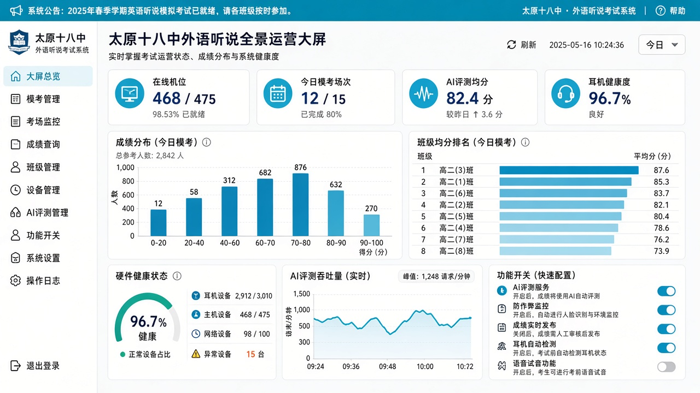

# 太原市第十八中学校外语听说模考系统

- 上线主域名: [https://26-ty-oral-bid.softwarelink.net/](https://26-ty-oral-bid.softwarelink.net/)  
- 项目代码仓库: [https://github.com/softwarelink-net/26-ty-oral-bid](https://github.com/softwarelink-net/26-ty-oral-bid)



---

## 部署与运行说明

### 环境要求
- Node.js >= 18.0.0
- npm >= 9.0.0 或 pnpm >= 8.0.0

### 安装依赖
```bash
npm install
```

### 本地运行
```bash
# 启动前端本地开发服务器 (纯前端运行，自动加载本地 SQLite 数据库文件)
npm run dev
```
启动完成后，在浏览器打开终端输出的本地开发服务器地址（如 `http://localhost:5173/`）即可体验完整系统。

### 演示账号一览
| 角色类型 | 登录账号 | 默认密码 | 角色标识 | 说明 |
| :--- | :--- | :--- | :--- | :--- |
| 系统超管 | `admin` | `Admin@2026` | `ROLE_SUPER_ADMIN` | 技术中心主任 / 系统架构师 |
| 教研主管 | `academic_lead`| `Lead@2026` | `ROLE_ACADEMIC_DIRECTOR` | 英语教研组长 / 考务主任 |
| 英语教师 | `teacher` | `Teacher@2026` | `ROLE_ENGLISH_TEACHER` | 高考班英语教师 / 考场监考员 |
| 校领导层 | `leader` | `Leader@2026` | `ROLE_DECISION_MAKER` | 教学副校长 / 决策长官 |

### 常用脚本一览
- `npm run dev`: 本地启动 Vite 高性能开发服务器
- `npm run build`: 前端生产构建打包并输出到 dist 纯静态目录
- `npm run preview`: 本地预览生产构建产物
- `npm run lint`: 执行代码规范检查与 TypeScript 类型校验

### 目录结构
```text
26-ty-oral-bid/
├── docs/
│   └── assets/
│       └── dashboard-preview.png
├── public/
│   ├── data/
│   │   └── tyoral_database.sqlite
│   ├── sitemap.xml
│   └── favicon.ico
├── src/
│   ├── assets/
│   ├── components/
│   │   ├── common/
│   │   │   └── GlobalStickyBanner.vue
│   │   └── layout/
│   ├── layouts/
│   │   ├── AuthLayout.vue
│   │   └── MainLayout.vue
│   ├── router/
│   └── stores/
│   ├── utils/
│   │   └── sqljs-engine.ts
│   ├── views/
│   │   ├── auth/
│   │   ├── dashboard/
│   │   ├── scheduling/
│   │   ├── assessment/
│   │   ├── proctoring/
│   │   ├── diagnostic/
│   │   └── system/
│   ├── App.vue
│   └── main.ts
├── schema.sql
├── package.json
└── README.md
```

---

## 招标公告全文

### 1. 标题
太原市第十八中学校外语听说模考系统公开招标采购招标公告

### 2. 项目发包方
太原市第十八中学校

### 3. 项目编号
1401992026AGK00696

### 4. 项目发布时间
2026-09-18 10:00:00

### 5. 关键词
太原市第十八中学校, 外语听说模考系统, 听说模拟考试系统, 听力专用耳机, 定制隔断, 1401992026AGK00696, 山西政府采购

### 6. 摘要
太原市第十八中学校委托太原市公共资源交易中心对校外语听说模考系统组织公开招标，预算金额1,191,500.00元，最高限价1,080,566.80元。采购内容涵盖9套听说模拟考试系统、475副头戴式听力专用耳机及466块定制隔断，合同签订之日起15个日历天内完成供货安装调试并达到验收条件，不接受联合体投标，投标文件递交截止时间为2026年10月12日09:30。

### 7. 技术要点
- **475考位高并发全真机考排程与防作弊机房管控**：支持考生排座、防切屏锁屏与异常声波过滤。
- **国家新课标多维语音评测算法与音素级智能纠错**：实现准确度、流利度、韵律完整度自动化算分。
- **考教闭环学情诊断与班级高频错词知识图谱**：自动归纳听说薄弱点并派发强化训练。
- **纯前端 WebAssembly sql.js 边缘极速响应体系**：零服务器常驻运维开销，数据本地极简持久化。

### 8. 技术创新性
- **全要素外语听说教考评数字孪生指挥看板**：宏观洞察各班听说成绩梯队演变与硬件终端运行健康度。
- **统一业务命名空间严格隔离架构**：统一采用专用数据表前缀与独立本地存储载体，杜绝多系统交叉干扰。

---

## 免责声明

1. **数据来源与合规性**：本项目所涉数据信息均采集自互联网公开渠道发布的标讯公示信息。项目开发者严格遵守《中华人民共和国数据安全法》及相关法律法规，确保数据来源合法、公开、可查询。
2. **技术实现路径**：本项目核心内容系基于国产大语言模型进行算法推演与自动化构造生成，非直接引用或复制原始招标文件。
3. **保密承诺**：本项目郑重承诺：不涉及、不包含任何国家秘密、商业秘密或未公开的敏感信息。所有生成内容均基于公开数据的逻辑推演。
4. **知识产权与巧合声明**：鉴于本项目内容均由AI模型基于公开数据推演生成，若生成内容在表述方式、结构逻辑上与任何第三方原始标书文件存在相似之处，纯属技术通用设计之巧合，不构成对任何第三方著作权的侵犯或商业秘密的泄露。本项目不保证生成内容的准确性与完整性，仅供技术研究与学习参考。
5. **免责条款**：任何单位或个人使用本项目代码及生成内容所产生的一切后果，均由使用者自行承担，项目开发者不承担任何法律责任。
